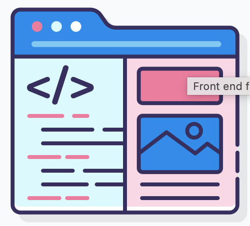

# Project-3

https://kass173.github.io/project-3/

## Project Group: Cheila, Kassem, Amar, Lionel, Safo  

## Team Workloads

Cheila - Data cleaning - Python, Database.  
Amar - Data Clean & Front End Dev  
Kass - Front End Dev, Readme & Proposal  
Lionel - Database Dev, (SQL, Mongo DB)  
Safo - 

### Intro

Our topic is to analyse the cost of living trends in 2022. The rationale behind this is as we are all currently living in the difficult times 
bought on by the cost of living crisis which is effecting all of us in the group.
So we all had a personal motivation to look at this subject, but wanted to see the effects on a more grander scale. 
We will create a webpage dashboard that allows you to look at 4 levels of data related to heat map looking at the cost of living data, 2 visuals
looking at the cheapest and most expensive places to live and lastly, a visual looking at house prices and rent for our selected locations.

## Front End

For the front end we based our web based dashboard on our final wire frame. 

https://github.com/kass173/project-3/blob/main/Wireframes/Final%20Wireframe%20of%20Project%203.png

### 1. HTML Pages
Firstly, we built the html webpage that our visual dashboard would sit on the main piece of work here was to create our drop down list as opposed to the 
easier route of creating seperate pages for our visuals to sit on.  
As well as the course links for our visualisations.

### 2. SQL Database & app.py
Secondly, we create our script to connect our databased to the html and defined the routes for the data by creating and "app.route". And defined the data
we wanted to select from our database table and connect and injected into our webpage. Now that this was done we could focus on creating our visuals.

### 3. Java Script
Lastly, we used Javascript to produce our visualisations for our webpage dashboard. We were required to create a minimum of 3 unique views to present our
data we met this by creating 4 visuals in 3 differant unique ways. We created a heatmap to show the cost of living index across the world, we then
created 2 bar charts for the top 10 most expensive and cheapest places to live based on cost of living and then we looked just at the rent index and
focused on the most expensive places to live just based on rent.   

The dashboard is multiple user-driven interactions (such as by using dropdowns menu, a hover function to show intrinsic data and a x feature) which is
included all on a single webpage dashbaord.  
The final page displays visualizations in a clear, digestable manner and is clearly displayed with no to many data lables to focus on and the data story
is easy to interpret for users of all levels.

## Back End

Data and Delivery (20 points)
1.Data components used in the project are clearly documented. (5 points).  
2.The dataset contains at least 100 unique records. (5 points).  
3. A database is used to house the data (SQL, MongoDB, SQLite, etc.). (5 points).  
4. The project is powered by a Python Flask API and includes HTML/CSS, JavaScript, and the chosen database. (5 points).  

Back End (20 points)
1. The page created to showcase data visualizations runs without error. (5 points).  
2. A JavaScript library not shown in class is used in the project. (5 points).  
3. The project conforms to one of the following designs: (10 points)
A Leaflet or Plotly chart built from data gathered through web scraping.
A dashboard page with multiple charts that all reference the same data.

